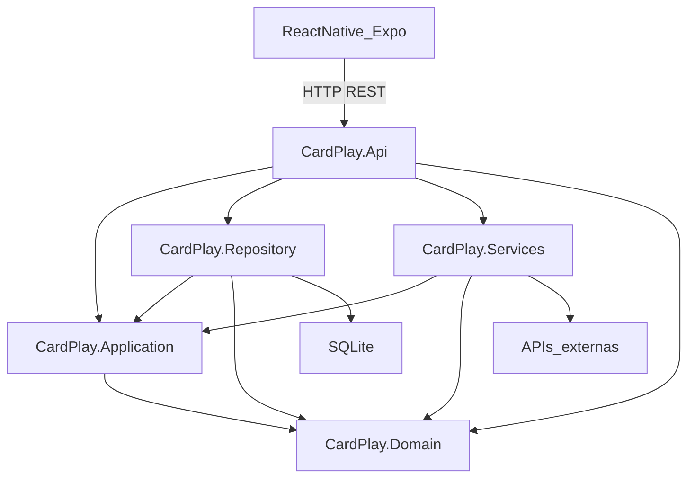

# Arquitetura

CardPlay é um monorepositório didático. Para instalar SDK, Node e pacotes, o aluno começa pelo [COMECEPORAQUI.md](../COMECEPORAQUI.md).

O caminho de uma ação do aplicativo até o banco é este:

```text
React Native
     ↓
ASP.NET Core API
     ↓
Application
     ↓
Domain
     ↙                    ↘
Repository / EF Core      Services / APIs externas
     ↓
SQLite
```

Application orquestra o caso de uso e fala com o domínio. Persistência e APIs externas ficam em camadas de infraestrutura no mesmo nível: Repository e Services.

Nesta versão **não há** chamadas a serviços externos. `CardPlay.Services` existe para marcar esse lugar; a recarga e o catálogo passam só por Application → Repository → SQLite.

## Dependências reais entre projetos

O diagrama de camadas acima descreve o fluxo em tempo de execução. As referências de compilação são estas:

```text
mobile  --HTTP-->  CardPlay.Api

CardPlay.Api         referencia  Application, Repository, Services, Domain
CardPlay.Repository  referencia  Application, Domain
CardPlay.Services    referencia  Application, Domain
CardPlay.Application referencia  Domain
CardPlay.Domain      não referencia ninguém do solution
CardPlay.Tests       referencia  Domain, Application, Repository
```



O Api é o composition root: registra `DbContext`, repositórios e, no futuro, clientes externos. Os controllers dependem das interfaces da Application (`ICartaoServico`, `IProdutoServico`). As implementações desses casos de uso também ficam na Application.

## Por que Application e Services estão separados

Application guarda contratos, DTOs e a orquestração interna (solicitar cartão, recarregar, listar produtos).

Services consome APIs que **não** pertencem ao CardPlay. Não implementa caso de uso. Fica no mesmo nível do Repository.

Sem essa regra, a camada Services vira um segundo Application e a dependência com o mundo externo some do desenho.

## Modelo

- **Cartao:** id, nome do titular, código amigável (`CP-XXXXXX`), saldo (`decimal`) e data de criação.
- **MovimentacaoCartao:** valor, descrição e data/hora. Nesta versão, só recargas.
- **Produto:** nome, descrição curta, preço, ícone/emoji e disponibilidade. Os registros iniciais vêm de seed, não de uma tela admin.

A recarga é um método do domínio. Se o valor for menor ou igual a zero, o domínio rejeita. Caso contrário, soma o saldo e cria a movimentação. O repositório grava os dois no mesmo `SaveChanges`.

## Frontend

O aplicativo Expo fala com a API por `fetch`, isolado em `mobile/src/api`. A base da URL sai de `EXPO_PUBLIC_API_URL`. Telas não montam endereço de servidor.

A paleta e as regras de usabilidade ficam em [ui.md](ui.md). Azul identifica o produto; laranja identifica saldo e ações. Tokens em `mobile/src/tema/cores.ts`. A barra de abas respeita a área segura; o catálogo usa uma coluna em telas estreitas (menos de 720px).
